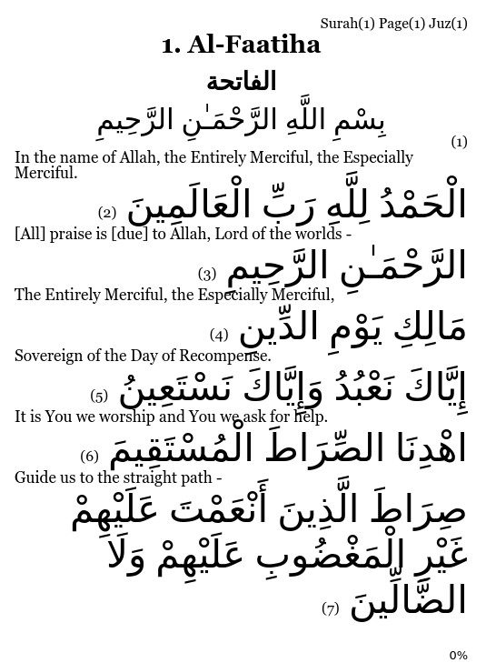

# quranebook

The project is an attempt to create an ebook of the Noble Quran. Arabic text goes together with translation. 
Initial idea is to have a daily reading ebook format of the Quran which has bigger arabic text and smaller translation underneath.
Supported formats:
 - [epub](https://github.com/hamdido/quranebook/wiki)

Further conversion can be done using external tools as [Calibre](https://calibre-ebook.com/). When converting check "Disable font size rescaling" in "Look & Feel" tab.
For Kindle reader I use AZW3 format as it preserve the styling.

> 
 
Resources:
- quran.txt - Quran text downloaded from https://tanzil.net/download/. Format is with aya numbers.
- translation_en.txt - Quran translation dowloaded from https://tanzil.net/trans/. Format is with aya numbers.  
- meta.xml - metadata in xml format dowloaded from https://tanzil.net/docs/Quran_Metadata

Additional translations can be generated by passing "lang" parameter and having correct file download into "src/main/resources/data" folder.  

Existing tranlations you can find in [Wiki](https://github.com/hamdido/quranebook/wiki)

# Technical Details
For developing the ebook it is using Java and Quarkus

You can run your application in dev mode that enables live coding using:
```shell script
./mvnw compile quarkus:dev
```

## Packaging and running the application

The application can be packaged using:
```shell script
./mvnw package
java -jar target/quarkus-app/quarkus-run.jar -d=src/main/resources -l=EN
```

```shell script
./mvnw package -Dquarkus.package.type=uber-jar
java -jar target/*-runner.jar
```
Check geerated file quran_en.epub

## Creating a native executable

You can create a native executable using: 
```shell script
./mvnw package -Pnative
```

Or, if you don't have GraalVM installed, you can run the native executable build in a container using: 
```shell script
./mvnw package -Pnative -Dquarkus.native.container-build=true
```

You can then execute your native executable with:
```
./target/quranebook-1.0.0-SNAPSHOT-runner -d=src/main/resources -l=EN
``` 

If you want to learn more about building native executables, please consult https://quarkus.io/guides/maven-tooling.

## References
 - [EpubLib](https://github.com/psiegman/epublib)
 - [Calibre](https://calibre-ebook.com/)
 - [SVG editor](https://editor.method.ac/)
 - [Wiki](https://github.com/hamdido/quranebook/wiki)